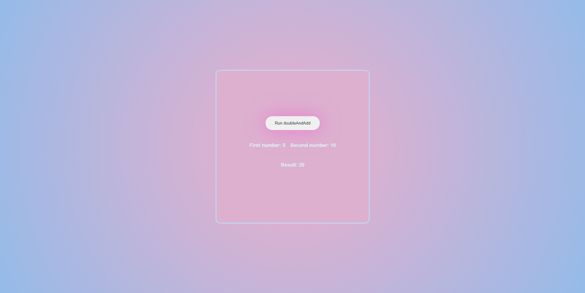

# 🎲 JavaScript Random Projects Collection

This repository contains 3 independent mini-projects built with JavaScript that demonstrate working with randomness, asynchronous behavior, and simple UI updates.

---

## 📌 Projects Included

1. **Random Promise Handler** – A button that randomly resolves or rejects a message.
2. **Double & Add with Random Numbers** – Generates two random numbers and calculates a custom result.
3. **DogAPI - Random Dog Image Viewer** – Fetches and displays random dog images using an external API.

---

## 📂 Folder Structure

Each folder contains its own `index.html`, script files, and a dedicated `README.md`.

---

## ▶️ How to Run

1. Clone the repository:
   ```bash
   git clone https://github.com/Zhraabdi/js-random-projects.git
   cd js-random-projects


---


## 📸 Preview :





